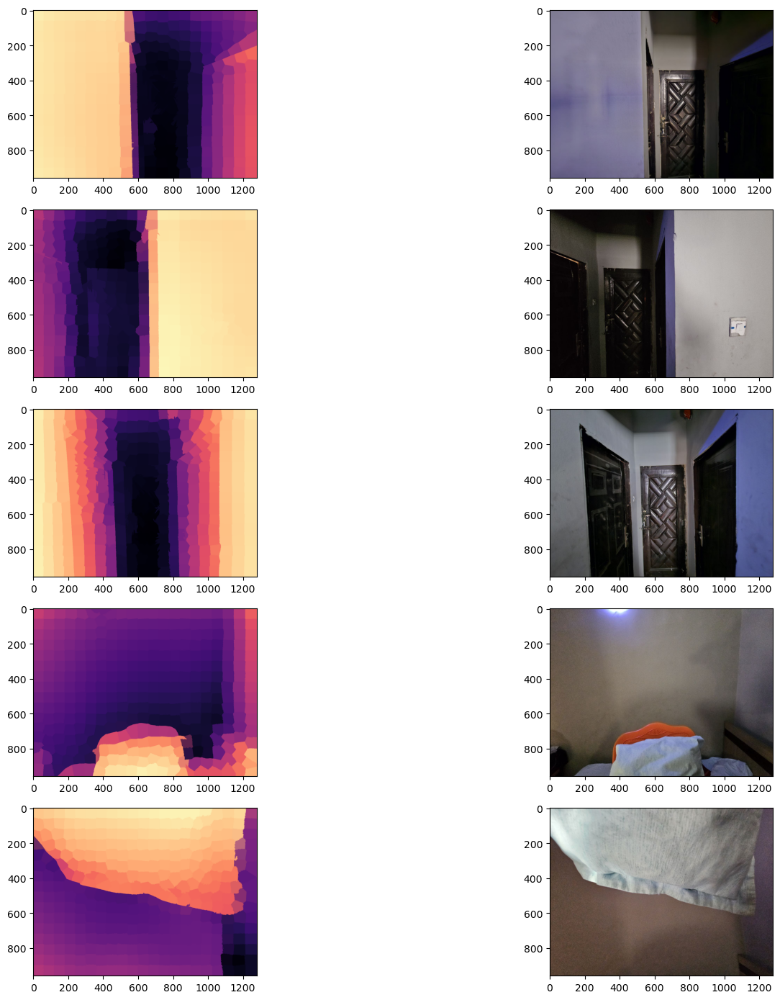

# Monocular Image Depth Localization with 3D Audio Feedback 

This project involves using an AI model called ZoeDepth to estimate the position of an object based on its depth using a single camera. The depth of objects within the scene can be approximated down to 2 meters. To localize the objects, I extract superpixels from the image, which groups similar pixels into clusters, making it easier to work with than raw pixels. Then, I calculate the average depth for each superpixel and determine its position relative to the camera (left, right, up, down). I create a stereo sine wave for each superpixel based on its position relative to the camera, so that left objects produce sounds louder at the left side and vice versa on the right. The height information is encoded as frequencies of the audio, with higher pixel regions producing lower frequencies and lower pixel regions producing higher frequencies.

For more details, please see the evaluation notebook.

